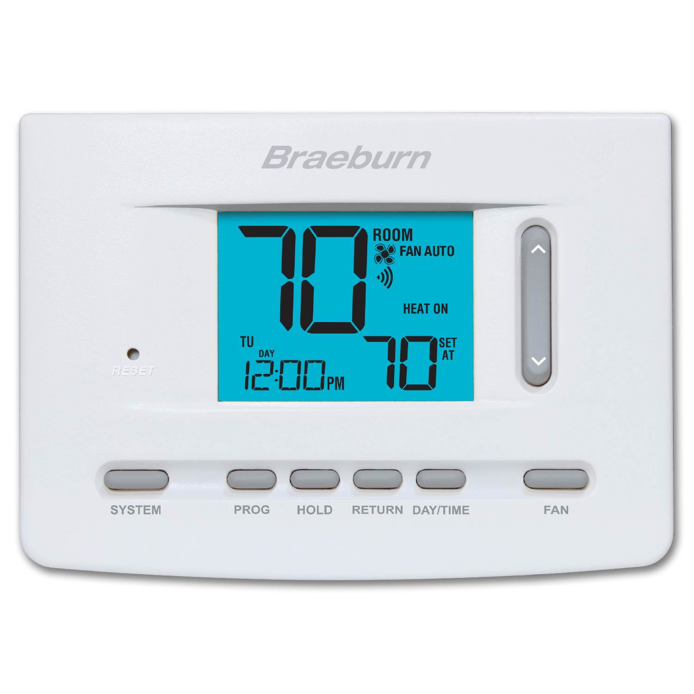

# Thermostat Scheduler

This project manages a [Braeburn BlueLink Smart Connect](https://bluelinksmartconnect.com/) thermostat program to
optimize energy consumption during peak demand periods, potentially saving money on electricity bills using
Hydro-Québec's
[Winter Credit Option](https://www.hydroquebec.com/residential/customer-space/rates/winter-credit-option.html).
It pre-heats before the peak demand period starts, then lowers the set temperature, and finally returns to the normal
program once the peak demand period is over.

While only tested with the [BlueLink Model 7205](https://www.braeburnonline.com/products/thermostat/7205), it should
in theory work with any BlueLink Smart Connect compatible thermostat.



## How it Works

This scheduler uses a configuration file (`config.yaml`) to define the regular thermostat program and the adjustments
to make during peak demand events. Once a day, it downloads and caches a list of
[upcoming peak demand periods](https://www.hydroquebec.com/documents-data/open-data/peak-demand-events/) from
Hydro-Québec and automatically adjusts the thermostat program accordingly.

## Setup

**Configuration:** Create a `config.yaml` file based on the example below. This file defines your normal heating/cooling
schedule and the temperature adjustments for peak events.

```yaml
normal_program:
  sunday:
    morning: { time: 7h,  heat: 21, cool: 24 }
    day:     { time: 9h,  heat: 20, cool: 25 }
    evening: { time: 16h, heat: 21, cool: 24 }
    night:   { time: 21h, heat: 20, cool: 25 }
  # ... other days of the week

peak_program:
  pre_heat_duration: 1h       # Time to pre-heat before peak
  pre_heat_temp_offset: 1     # Temperature increase for pre-heating
  peak_temp_offset: -2        # Temperature decrease during peak
```

**Scheduling**: Set up a cron job or other scheduling mechanism to run the script regularly (e.g., every few hours) to
ensure the program is updated in response to peak demand periods. Suggested cron times are 5am, 8am, 3pm, and 9pm to
cover Hydro-Québec's typical peak demand periods.
